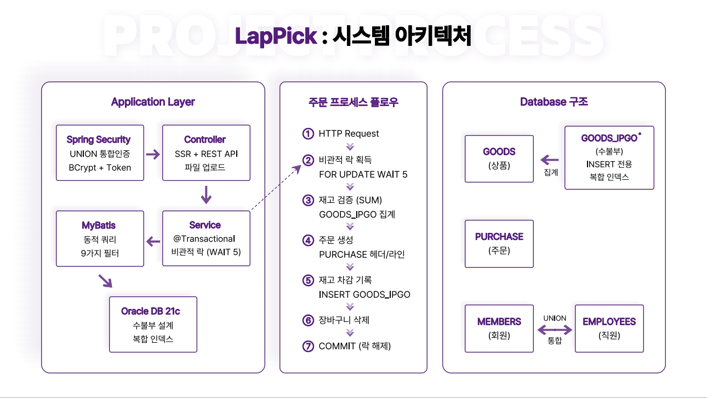
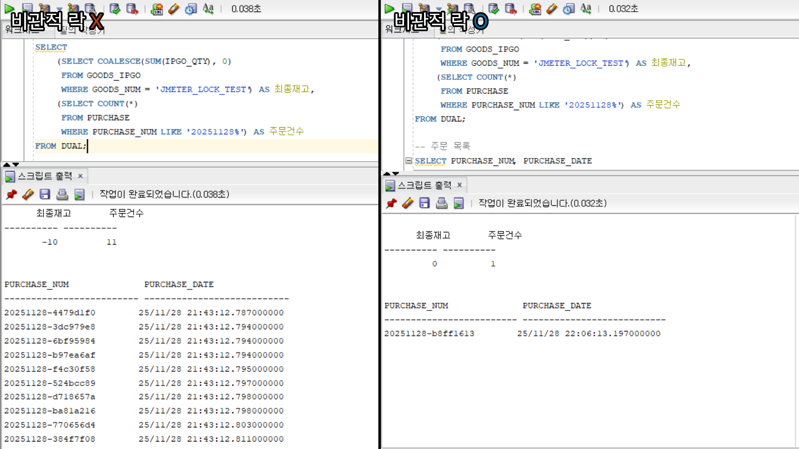
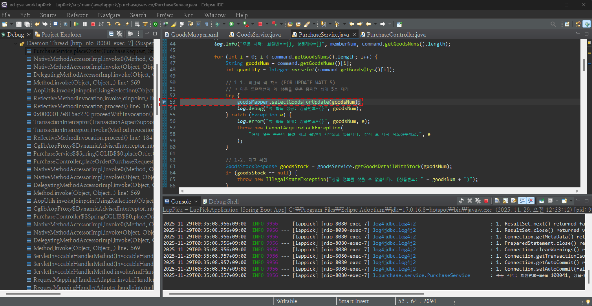

# LapPick

간단한 5가지 필터로 노트북을 쉽게 찾을 수 있는 쇼핑몰입니다.  
깔끔한 UI와 직관적인 UX로 누구나 편하게 사용할 수 있도록 했습니다.


**개발 기간:** 2025.08.12 ~ 2025.11.08 (1인 프로젝트)

---

## 왜 만들었나

요즘 노트북 쇼핑몰에 들어가면 필터가 너무 많습니다.  
CPU 종류, RAM 용량, SSD 용량, GPU 모델, 화면 해상도, 주사율...

선택지가 수십 개나 되니까 초보 사용자는 선택하기도 전에 지쳐버립니다.

스펙도 중요하지만, 너무 많은 선택지는 오히려 선택을 어렵게 만든다고 판단해  
필터를 5가지로 줄이고 입력도 간편하게 만들어
누구나 쉽게 노트북을 찾을 수 있는 쇼핑몰을 만들고 싶었습니다.

---

## 주요 기능


*LapPick 시스템 구조 및 주문 프로세스 플로우*

### 1. 상품 필터 (5가지만)

1. 브랜드 (9개 체크박스)  
   SAMSUNG, LG, APPLE, MSI, ASUS, LENOVO, MICROSOFT, HP, HANSUNG

2. 용도 (3개 체크박스)  
   - 사무용: 문서 작업, 인터넷 검색
   - 게임용: 고사양 게임
   - 영상편집: 영상 작업, 그래픽 디자인

3. 가격 (범위 입력)  
   만원 단위 입력 (예: 150 ~ 300 → 150만원 ~ 300만원)

4. 스크린 (범위 입력)  
   인치 단위 (예: 13.3 ~ 17.3)  
   편의 기능: 156 입력 → 15.6 자동 변환

5. 무게 (범위 입력)  
   kg 단위 (예: 1.0 ~ 1.7)  
   편의 기능: 125 입력 → 1.25 자동 변환

자동 변환 기능:

상품을 등록하다 보니 소수점 입력이 생각보다 번거롭다는 것을 
깨닫고 사용자 편의를 위해 간편 입력 기능을 만들었습니다.

"156" 입력 → 15.6으로 자동 변환  
"125" 입력 → 1.25로 자동 변환

서버에서 처리:
```java
// 156 → 15.6
if (command.getGoodsScreenSize() != null) {
    dto.setGoodsScreenSize(command.getGoodsScreenSize() / 10.0);
}

// 125 → 1.25
if (command.getGoodsWeight() != null) {
    dto.setGoodsWeight(command.getGoodsWeight() / 100.0);
}
```

---

### 2. 수불부 기반 재고 관리

GOODS 테이블에 STOCK 컬럼을 두려고 했는데, 만약
"재고가 왜 마이너스가 됐지?" 같은 문제가 생기면 원인을 알 수 없을 것 같았습니다.

그래서 회계에서 쓰는 수불부 방식을 적용했습니다.

GOODS_IPGO 테이블에 모든 재고 변동을 INSERT로만 기록하고,  
SUM(IPGO_QTY)으로 현재 재고를 계산합니다.

```
입고: +100
주문: -1
취소: +1
```

이렇게 하면:
- 재고가 언제 어떻게 바뀌었는지 다 남음
- UPDATE 없이 INSERT만 써서 동시성 충돌도 줄어듦
- 나중에 문제가 생겨도 이력을 추적할 수 있음

대신 매번 SUM을 계산해야 해서 느릴 수 있는데,  
복합 인덱스 (GOODS_NUM, IPGO_QTY)로 해결했습니다.

---

### 3. 장바구니

```sql
MERGE INTO CART C
USING (SELECT GOODS_NUM FROM GOODS WHERE GOODS_NUM = #{goodsNum}) G
ON (C.GOODS_NUM = G.GOODS_NUM AND C.MEMBER_NUM = #{memberNum})
WHEN MATCHED THEN
    UPDATE SET CART_QTY = CART_QTY + #{cartQty}
WHEN NOT MATCHED THEN
    INSERT (CART_NUM, MEMBER_NUM, GOODS_NUM, CART_DATE, CART_QTY)
    VALUES ((SELECT COALESCE(MAX(CART_NUM), 0) + 1 FROM CART),
            #{memberNum}, #{goodsNum}, SYSDATE, #{cartQty})
```

이미 담긴 상품이면 수량만 증가시키고, 없으면 새로 추가합니다.

"있는지 확인 → 있으면 UPDATE / 없으면 INSERT" 방식으로 구현하다가,
Oracle의 MERGE 문으로 이를 하나의 쿼리로 처리할 수 있다는 걸 알게 됐습니다.

---

### 4. 주문 프로세스

```java
@Transactional(
    propagation = Propagation.REQUIRED,
    isolation = Isolation.READ_COMMITTED,
    timeout = 10,
    rollbackFor = Exception.class
)
public String placeOrder(...) {
    // 1. 상품 락 획득
    try {
        goodsMapper.selectGoodsForUpdate(goodsNum);
    } catch (Exception e) {
        throw new CannotAcquireLockException(
            "다른 사용자가 주문 중입니다. 잠시 후 다시 시도해주세요.", e
        );
    }
    
    // 2. 재고 확인
    if (stock < quantity) {
        throw new IllegalStateException(
            String.format("상품명: '%s' 재고가 부족합니다.", goodsName)
        );
    }
    
    // 3. 주문 생성
    purchaseMapper.insertPurchase(...);
    
    // 4. 주문 상품 삽입
    purchaseMapper.insertPurchaseItem(...);
    
    // 5. 재고 차감
    goodsService.changeStock(goodsNum, -quantity, "주문");
    
    // 6. 장바구니 삭제
    cartMapper.goodsNumsDelete(...);
}
```

주문 상태:
```
결제완료 → 상품준비중 → 배송중 → 배송완료
```

주문 취소하면 재고 복구:
```java
goodsService.changeStock(goodsNum, +quantity, "주문 취소로 인한 재고 복구");
```

---

### 5. 리뷰 시스템

- 배송완료 상태에서만 작성 가능
- 1개 주문당 1개 리뷰
- 별점 1~5점
- 이미지 여러 장 업로드
- 관리자는 부적절한 리뷰를 숨김/삭제 가능

페이지네이션 클릭 시 스크롤 위치를 유지하는 기능을 추가했습니다.

처음에는 페이지를 넘길 때마다 맨 위로 올라가서 불편했는데,  
sessionStorage로 스크롤 위치를 저장해두고 복원하도록 만들었습니다.

```javascript
$('.pagination-container a').on('click', function(e) {
    sessionStorage.setItem('goodsDetailScrollPos', window.scrollY);
});

const savedScrollPos = sessionStorage.getItem('goodsDetailScrollPos');
if (savedScrollPos) {
    window.scrollTo(0, parseInt(savedScrollPos, 10));
}
```

---

## 기술 스택

Backend
- Spring Boot 3.4.0
- MyBatis 3.0.3
- Oracle 21c
- Spring Security 6

Frontend
- Thymeleaf
- jQuery/AJAX
- 다음 주소 API

Testing
- JMeter 5.6.3
- Eclipse Debugger
- EXPLAIN PLAN

---

## 실행 방법

1. 데이터베이스 설정
```sql
CREATE USER LAPPICK IDENTIFIED BY yourpassword;
GRANT CONNECT, RESOURCE TO LAPPICK;
```

2. application.properties
```properties
spring.datasource.url=jdbc:oracle:thin:@localhost:1521/XEPDB1
spring.datasource.username=LAPPICK
spring.datasource.password=yourpassword
```

3. 실행
```bash
mvn spring-boot:run
```

4. 접속
```
http://localhost:8080
```

일반 회원으로 로그인하면 장바구니 아이콘이 보이고,  
관리자로 로그인하면 장바구니 아이콘이 톱니바퀴로 바뀝니다.

---

## 성능 테스트 결과

### JMeter 동시성 테스트

재고 1개 남은 상품에 100명이 동시 주문했을 때:

| 구분 | 비관적 락 X | 비관적 락 O |
|------|------------|------------|
| 주문 성공 | 11명 | 1명 |
| 재고 결과 | -10 | 0 |
| 평균 응답 시간 | 88ms | 380ms |


*왼쪽(비관적 락 X): 재고 -10, 11명 주문 성공 | 오른쪽(비관적 락 O): 재고 0, 1명만 주문 성공*

상세 테스트: [비관적_락_동시성_테스트.pdf](docs/비관적_락_동시성_테스트.pdf)

성능은 약 4배 느려졌지만, 쇼핑몰에서 오버셀링과 같은 금전적인 오류는 
치명적이므로 허용 가능한 범위 내에서 정합성을 택했습니다.

---

## 리팩토링 내역

프로젝트를 완성하고 코드를 다시 보니까 개선할 부분이 많이 보였습니다.

### 주요 개선 사항

#### 1. 동시성 제어 강화
- `@Transactional` 명시적 설정 (timeout=10, isolation=READ_COMMITTED)
- FOR UPDATE 도입
- 예외 처리 세분화 (CannotAcquireLockException / IllegalStateException)

#### 2. 로깅 시스템 개선
- System.out.println → Logger 전환
- 로그 레벨 구분 (INFO/ERROR)

초기에는 System.out으로 출력했는데,  
나중에 찾아보니 로그 레벨 제어가 안 되고 성능에도 영향을 준다는 걸 알게 됐습니다.

---

## 어려웠던 점과 해결 과정

### 1. 동시성 문제 발견

쇼핑몰 기능 구현을 완료하고 부하 테스트를 하기 전까지는  
동시성 문제를 예상하지 못했습니다.

"100명이 동시에 주문하면 어떻게 될까?" 궁금해서  
JMeter로 부하 테스트를 돌려봤습니다.

테스트를 돌려보고 나서 DB를 확인해봤더니,  
재고가 -10으로 나와서 "이건 큰 문제다"라고 생각했습니다.

결과:
- 재고 1개 상품에 100명 동시 주문
- 11명이 주문 성공
- 재고가 -10이 됨

이게 바로 오버셀링 문제였습니다.

원인:

```java
// 기존 코드 (문제 있음)
int stock = goodsMapper.getStock(goodsNum);  // 1. 재고 조회
if (stock > 0) {
    purchaseMapper.insert(...);              // 2. 주문 생성
    goodsMapper.updateStock(goodsNum, -1);   // 3. 재고 차감
}
```

1번과 3번 사이에 다른 요청이 끼어들 수 있어서,  
여러 명이 동시에 재고 1을 읽고 주문하는 문제였습니다.

| 시간 | Thread A | Thread B | 재고 |
|------|----------|----------|------|
| t1 | stock = 1 조회 | | 1 |
| t2 | | stock = 1 조회 | 1 |
| t3 | 주문 생성 | | 1 |
| t4 | | 주문 생성 | 1 |
| t5 | 재고 차감 (1→0) | | 0 |
| t6 | | 재고 차감 (0→-1) | -1 |

해결:

비관적 락(FOR UPDATE)을 찾아서 적용했습니다.

```java
// 개선된 코드
goodsMapper.selectGoodsForUpdate(goodsNum);  // 1. 락 획득
int stock = goodsMapper.getStock(goodsNum);  // 2. 재고 조회
if (stock > 0) {
    purchaseMapper.insert(...);              // 3. 주문 생성
    goodsMapper.updateStock(goodsNum, -1);   // 4. 재고 차감
}
// COMMIT 시 락 해제
```

```sql
SELECT GOODS_NUM FROM GOODS 
WHERE GOODS_NUM = #{goodsNum} 
FOR UPDATE WAIT 5
```

검증 과정:

처음에는 "이게 정말 동작하나?" 확신이 안 섰습니다.  
그래서 Eclipse Debugger로 직접 확인해봤습니다.

1. User A가 주문 시작 (Breakpoint로 멈춤)
2. User B가 같은 상품 주문 시도
3. User B 브라우저가 무한 로딩 → Lock 대기 중
4. User A Resume → 주문 완료
5. User B 진행 → 재고 부족으로 실패


*User A Breakpoint 실행 → User B Lock 대기 → User A 완료 → User B 진행*

실제로 검증하고 나서야 "Lock이 진짜 동작하는구나" 확신이 들었습니다.

상세 검증: [Eclipse_Blocking_검증.pdf](docs/Eclipse_Blocking_검증.pdf)

---

### 2. 수불부 설계 결정

처음에는 GOODS 테이블에 STOCK 컬럼을 두려고 했습니다.

```sql
-- 처음 생각한 구조
GOODS (
    GOODS_NUM,
    STOCK INT  -- 현재 재고
)
```

근데 이렇게 하면 "재고가 왜 마이너스가 됐지?" 같은 문제가 생겼을 때  
원인을 추적할 방법이 없었습니다.

회계에서 쓰는 수불부 개념을 찾아보니,  
모든 입출고를 기록으로 남기고 합계로 재고를 계산하는 방식이었습니다.

```sql
-- 수불부 방식
GOODS_IPGO (
    IPGO_NUM,
    GOODS_NUM,
    IPGO_QTY INT,  -- +100 (입고) / -1 (주문) / +1 (취소)
    IPGO_DATE
)

-- 현재 재고 = SUM(IPGO_QTY)
```

이렇게 하니 모든 재고 변동 이력이 남았고,  
나중에 문제가 생겨도 추적할 수 있게 됐습니다.

대신 매번 SUM을 계산해야 해서 느릴 수 있는데,  
복합 인덱스 (GOODS_NUM, IPGO_QTY)로 해결했습니다.

성능 테스트를 위해 10만 건 더미 데이터를 넣고 EXPLAIN PLAN으로 확인해보니  
Cost가 310 → 105로 떨어졌습니다.

실행 계획 (인덱스 없음):
```
Cost: 310
Operation: TABLE ACCESS FULL
Rows: 100,057
```

실행 계획 (인덱스 있음):
```
Cost: 105 (66.1% 개선)
Operation: INDEX FAST FULL SCAN
```

실제 데이터는 85건 정도지만, 나중에 데이터가 많이 쌓였을 때를 대비해서  
복합 인덱스를 미리 만들어뒀습니다.

상세 분석: [복합_인덱스_성능_테스트.pdf](docs/복합_인덱스_성능_테스트.pdf)

---

### 3. 예외 처리 세분화

처음에는 모든 예외를 `Exception`으로 잡아서 처리했습니다.

```java
} catch (Exception e) {
    log.error("주문 처리 중 오류", e);
    return "error";
}
```

근데 이렇게 하면 락 타임아웃인지, 재고 부족인지, 시스템 에러인지  
사용자에게 구체적으로 알려줄 수가 없었습니다.

그래서 예외를 세분화했습니다.

```java
try {
    goodsMapper.selectGoodsForUpdate(goodsNum);
} catch (Exception e) {
    throw new CannotAcquireLockException(
        "다른 사용자가 주문 중입니다. 잠시 후 다시 시도해주세요.", e
    );
}

if (stock < quantity) {
    throw new IllegalStateException(
        String.format("상품명: '%s' 재고가 부족합니다. (주문수량: %d, 현재재고: %d)", 
            goodsName, quantity, stock)
    );
}
```

이렇게 하니 사용자는 구체적인 오류 메시지를 보고,  
개발자는 로그로 원인을 빠르게 파악할 수 있게 됐습니다.

---

## 기술적 의사결정

### JPA 대신 MyBatis

상황:  
이 프로젝트는 복잡한 쿼리가 많았습니다.
- 재고 수불부 SUM 집계
- 주문 내역 3-4개 테이블 조인
- 9가지 필터 조건 동적 조합

결정:  
JPA로도 할 수 있지만 JPQL이나 Criteria API가 복잡해질 것 같아서  
SQL을 직접 제어할 수 있는 MyBatis를 선택했습니다.

EXPLAIN PLAN으로 쿼리 성능을 직접 확인하고 튜닝할 수 있어서 좋았습니다.

---

### 낙관적 락 vs 비관적 락

재고는 금전과 직결되어 단 1건의 오차도 허용할 수 없습니다.

| 방식 | 성능 | 정합성 | 선택 |
|------|------|--------|------|
| 낙관적 락 | 빠름 | 재시도 필요 | X |
| 비관적 락 | 느림 | 보장됨 | O |

낙관적 락은 충돌 발생 시 롤백하고 재시도해야 하는데,  
동시 주문이 많으면 재시도가 폭증할 것 같았습니다.

비관적 락은 대기 시간이 발생하지만 (88ms → 380ms),  
재고 정합성을 확실하게 보장할 수 있어서 선택했습니다.

---

### 회원/관리자 통합 인증

상황:  
MEMBERS 테이블과 EMPLOYEES 테이블이 분리되어 있어서  
인증 로직을 두 번 만들어야 할 것 같았습니다.

결정:  
SQL UNION ALL로 두 테이블을 합쳐서 단일 인증 객체를 만들었습니다.

```sql
SELECT 
    MEMBER_ID AS userId, MEMBER_PW AS userPw, 
    MEMBER_NAME AS userName, MEMBER_EMAIL AS userEmail, 
    'mem' AS grade
FROM MEMBERS
WHERE MEMBER_ID = #{userId}
UNION ALL
SELECT 
    EMP_ID AS userId, EMP_PW AS userPw, 
    EMP_NAME AS userName, EMP_EMAIL AS userEmail, 
    'emp' AS grade
FROM EMPLOYEES
WHERE EMP_ID = #{userId}
```

이렇게 하니 Spring Security 설정을 하나만 만들면 됐고,  
인증 로직 수정도 한 곳에서만 하면 됐습니다.

---

## 배운 점

### 1. 성능 측정의 중요성

"비관적 락을 쓰면 느려지겠지"라고 생각했는데,  
실제로 측정해보니 88ms → 380ms로 약 4배 정도 느려졌습니다.

예상보다는 느렸지만 허용 가능한 범위였습니다.

그리고 JMeter로 부하 테스트를 돌려보고,  
EXPLAIN PLAN으로 쿼리 성능을 확인하고,  
Eclipse Debugger로 Lock 동작을 눈으로 검증했습니다.

막연한 걱정보다 실제 측정이 중요하다는 걸 배웠습니다.

---

### 2. 복합 인덱스의 Covering Index 효과

인덱스는 WHERE 절만 빠르게 하는 줄 알았는데,  
SELECT 절까지 고려하면 더 빠를 수 있다는 걸 배웠습니다.

```sql
-- 인덱스: (GOODS_NUM, IPGO_QTY)
SELECT SUM(IPGO_QTY) FROM GOODS_IPGO WHERE GOODS_NUM = ?
```

이 쿼리는 인덱스만으로 처리가 가능해서 테이블 접근이 필요 없습니다.  
GOODS_NUM으로 찾고, IPGO_QTY는 이미 인덱스에 포함되어 있으니까요.

EXPLAIN PLAN으로 확인해보니 Cost가 310 → 105로 떨어졌습니다.

"어떤 컬럼을 인덱스에 넣을까"를 고민할 때  
WHERE 절만 보는 게 아니라 SELECT, ORDER BY까지 고려해야 한다는 걸 배웠습니다.

---

### 3. 리팩토링으로 얻은 깊이 있는 이해

프로젝트 당시에는 "기능 동작"에만 집중했는데,  
완료 후 코드를 다시 보면서 "왜 이렇게 해야 하는가"를 고민했습니다.

`@Transactional`:  
Spring이 알아서 트랜잭션 처리해주니까 안 써도 되는 줄 알았는데,  
명시적으로 쓰면 timeout, isolation 같은 걸 제어할 수 있었습니다.

Logger vs System.out:  
System.out은 왜 안 쓰는지 궁금해서 찾아봤습니다.  
로그 레벨 제어가 안 되고 성능에도 영향을 준다는 걸 알게 됐습니다.

구현할 때는 "돌아가게" 만드는 데 급급했다면,  
리팩토링하면서 "왜"를 이해하게 됐습니다.

---

## 개선하고 싶은 부분

현재는 JMeter로 통합 테스트만 진행했는데, 
단위 테스트를 작성하면 리팩토링할 때 더 안전하게 수정할 수 있을 것 같습니다.

특히 재고 차감이나 예외 처리 같은 핵심 로직은 
테스트 코드로 검증하는 게 맞다고 생각합니다.

---

## 연락처

이메일: jpb1632@gmail.com
GitHub: https://github.com/jpb1632